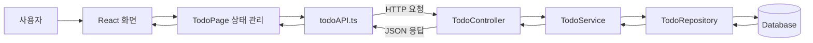
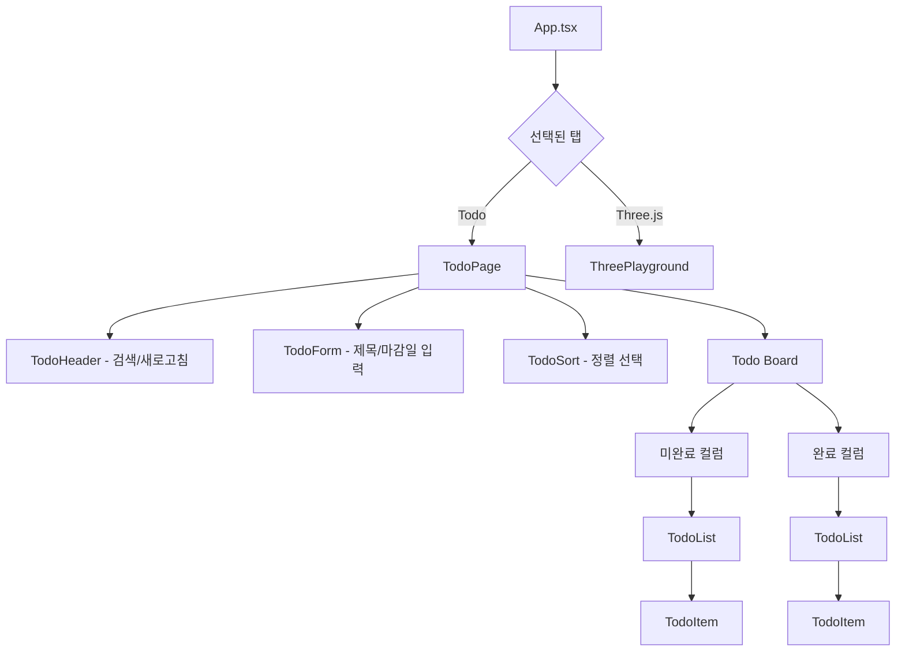
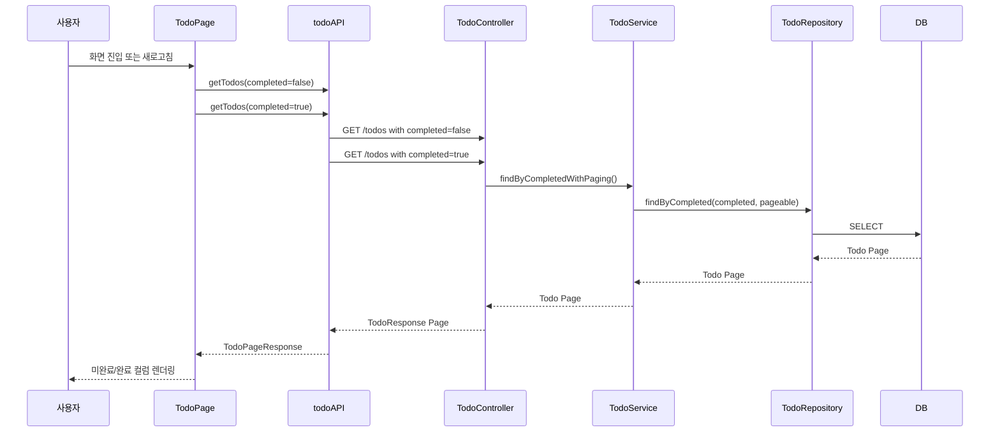
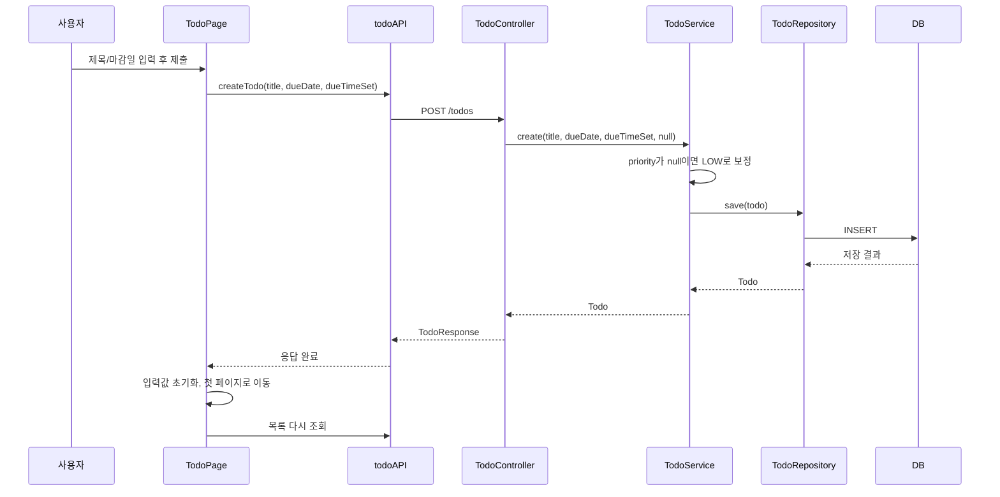
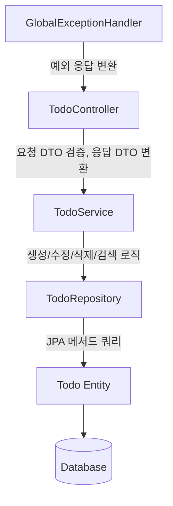
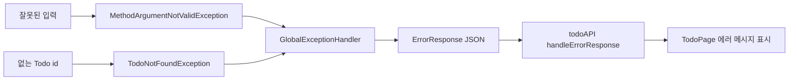

# Study Todo 프로젝트

Spring Boot 백엔드와 React/Vite 프론트엔드로 구성된 Todo 애플리케이션입니다. Todo 등록, 조회, 검색, 완료 처리, 수정, 삭제, 우선순위 변경, 페이징을 지원하며, 별도 탭에서 Three.js 태양계 예제를 볼 수 있습니다.

## 프로젝트 구조

```text
study
├── backend
│   ├── src/main/java/jjk/sst
│   │   ├── controller      # HTTP 요청을 받는 REST Controller
│   │   ├── service         # Todo 비즈니스 로직
│   │   ├── repository      # Spring Data JPA Repository
│   │   ├── domain          # Todo Entity, 우선순위 Enum
│   │   ├── dto             # 요청/응답 DTO
│   │   └── exception       # 예외 처리
│   └── src/main/resources
│       └── application-example.properties
└── frontend
    └── src
        ├── App.tsx
        └── features
            ├── todo        # Todo 화면, API, 컴포넌트, 타입
            └── playground  # Three.js 예제 화면
```

## 전체 흐름도



## 프론트엔드 화면 흐름



`TodoPage`는 Todo 화면의 중심 컴포넌트입니다. 다음 상태를 관리합니다.

- 미완료 Todo 페이지와 완료 Todo 페이지
- 검색어와 활성 검색어
- 로딩 상태와 에러 메시지
- 수정 중인 Todo
- 정렬 옵션
- Todo 입력 폼의 제목, 마감일, 시간 설정 여부

## Todo 데이터 요청 흐름



검색 중일 때는 `GET /todos/search`를 사용하고, 검색어가 없을 때는 `GET /todos`를 사용합니다. 두 경우 모두 미완료 목록과 완료 목록을 따로 요청합니다.

## Todo 생성 흐름



## 주요 API

| 기능 | Method | URL | 설명 |
| --- | --- | --- | --- |
| Todo 목록 조회 | `GET` | `/todos` | `completed`, `page`, `size`, `sort` 조건으로 페이징 조회 |
| Todo 검색 | `GET` | `/todos/search` | `keyword`, `completed`, `page`, `size`, `sort` 조건으로 검색 |
| Todo 단건 조회 | `GET` | `/todos/{id}` | id로 Todo 조회 |
| Todo 생성 | `POST` | `/todos` | 제목, 마감일, 시간 설정 여부로 Todo 생성 |
| Todo 수정 | `PUT` | `/todos/{id}` | 제목, 마감일, 시간 설정 여부 수정 |
| 완료 상태 변경 | `PATCH` | `/todos/{id}/toggle` | `completed` 값을 반대로 변경 |
| 우선순위 변경 | `PATCH` | `/todos/{id}/priority` | `LOW`, `MEDIUM`, `HIGH` 중 하나로 변경 |
| Todo 삭제 | `DELETE` | `/todos/{id}` | id로 Todo 삭제 |

## 백엔드 계층 역할



- `TodoController`: `/todos` 하위 REST API를 제공합니다.
- `TodoService`: Todo 생성, 조회, 수정, 삭제, 완료 토글, 검색, 페이징 로직을 담당합니다.
- `TodoRepository`: `JpaRepository`를 상속해 DB 접근을 담당합니다.
- `Todo`: Todo의 실제 저장 구조입니다.
- `GlobalExceptionHandler`: Todo가 없거나 입력 검증에 실패했을 때 에러 응답을 만듭니다.

## Todo 데이터 구조

프론트엔드 타입 기준:

```ts
export type Todo = {
  id: number;
  title: string;
  completed: boolean;
  dueDate: string | null;
  dueTimeSet: boolean;
  priority: "LOW" | "MEDIUM" | "HIGH";
};
```

백엔드 Entity 기준:

- `id`: Todo 식별자
- `title`: 제목
- `completed`: 완료 여부
- `createdAt`: 생성일
- `updatedAt`: 수정일
- `dueDate`: 마감일과 시간
- `dueTimeSet`: 사용자가 시간을 직접 설정했는지 여부
- `priority`: 우선순위

## 실행 방법

### 1. 백엔드 설정

`backend/src/main/resources/application-example.properties`를 참고해서 `application.properties`를 만듭니다.

```properties
spring.application.name=sst
server.port=9170

spring.datasource.url=jdbc:postgresql://localhost:5432/todo_db
spring.datasource.driver-class-name=org.postgresql.Driver
spring.datasource.username=your_username
spring.datasource.password=your_password

spring.jpa.hibernate.ddl-auto=update
spring.jpa.show-sql=true
spring.jpa.properties.hibernate.format_sql=true
```

백엔드 실행:

```bash
./gradlew :backend:bootRun
```

Windows PowerShell:

```powershell
.\gradlew.bat :backend:bootRun
```

### 2. 프론트엔드 설정

`frontend` 디렉터리에 `.env` 파일을 만들고 백엔드 주소를 설정합니다.

```env
VITE_API_BASE_URL=http://localhost:9170
```

프론트엔드 실행:

```bash
cd frontend
npm install
npm run dev
```

기본 Vite 주소는 `http://localhost:5173`입니다. 백엔드는 `TodoController`에서 `http://localhost:5173`에 대해 CORS를 허용하고 있습니다.

## 정렬과 페이징

- 백엔드 정렬은 `id` 기준입니다.
- `sort=desc`이면 최신 Todo가 먼저 옵니다.
- `sort=asc`이면 오래된 Todo가 먼저 옵니다.
- 프론트엔드의 `title`, `priority` 정렬은 현재 페이지 안에서 화면 표시 순서를 다시 정렬합니다.
- 미완료 목록과 완료 목록은 각각 독립적으로 페이지 번호를 가집니다.

## 예외 처리 흐름



프론트엔드는 응답이 실패하면 `handleErrorResponse`에서 에러 메시지를 꺼내 `TodoPage`의 토스트 메시지로 보여줍니다.
